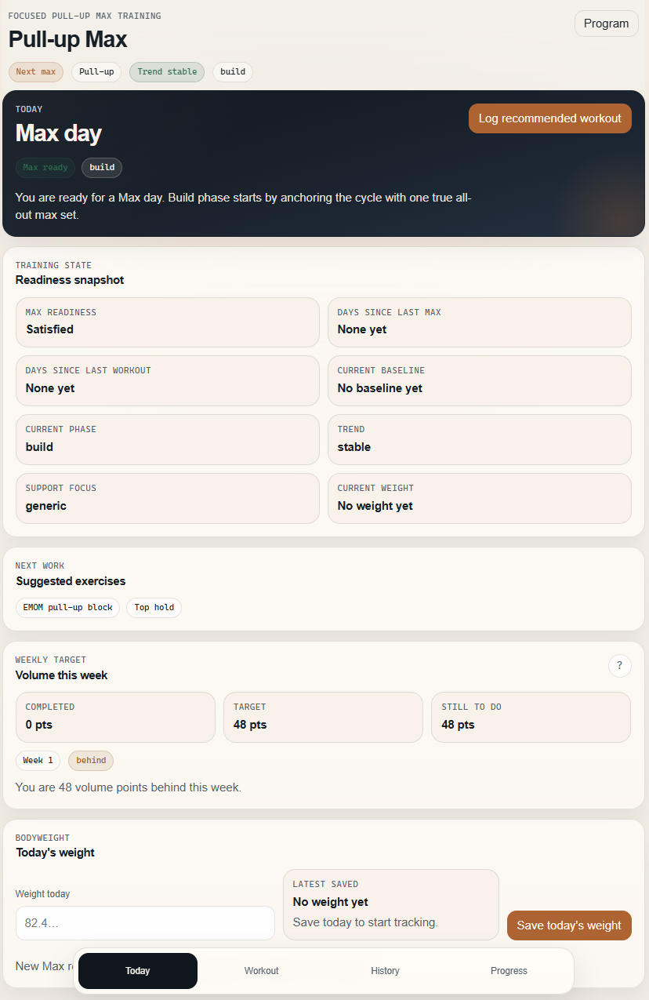
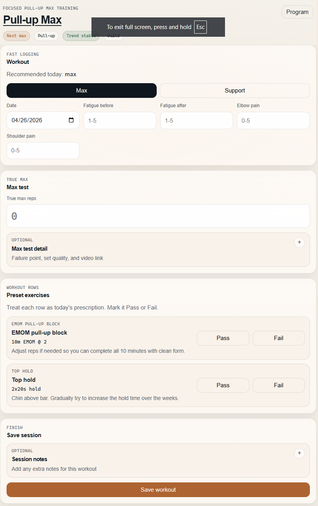
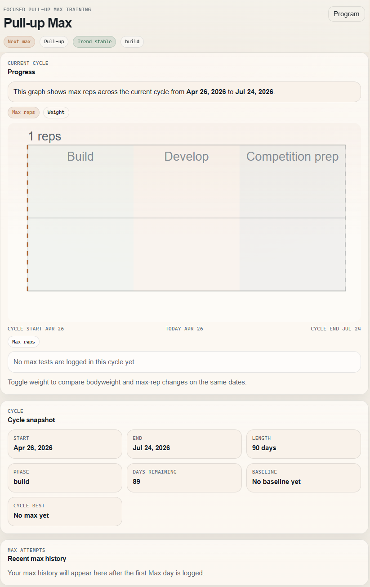

# Pull-up Max

**A compact local-first training app for improving your max strict pull-ups.**

Pull-up Max is built for one narrow job: helping you raise the number of clean
strict pull-ups you can do in one all-out set. It stays focused on max-rep
progress, removes generic workout-tracker clutter, and keeps logging fast on
mobile.

There is no backend, no auth, and no cloud account to manage. Your data stays
on your device, with JSON backup/export when you want it.

## Why it is useful

Most fitness apps are too broad for a single performance goal. Pull-up Max is
useful because it gives you:

- one clear max-pull-up workflow
- readiness rules for when a true max test should happen
- support-day prescriptions based on your latest weak point
- compact pass/fail logging for preset work
- local storage with offline-friendly PWA behavior

## Screenshots

<p align="center">
  <a href="docs/screenshots/dashboard.png">
    
  </a>
  <a href="docs/screenshots/workout.png">
    
  </a>
  <a href="docs/screenshots/progress.png">
    
  </a>
</p>

## Key Features

- **Today screen** with the recommended next session, readiness snapshot,
  suggested exercises, weekly volume target, and optional bodyweight logging
- **Workout logging** for Max and Support sessions with compact mobile-first
  flow
- **Pass / Fail preset rows** for built-in progression work instead of manual
  data entry on every default row
- **Progress view** with a lightweight cycle chart for max reps over time and
  an optional bodyweight overlay
- **Program editor** for cycle planning, main movement selection, editable
  default workout blocks, and embedded exercise library management
- **Local-first backups** through versioned JSON export/import
- **Offline-friendly installable app** via Vite PWA tooling

## Workout And Progression Logic

The app is anchored to one true max-rep test.

- A Max day is only recommended when at least `7` days have passed since the
  last max test and at least `2` full days have passed since the most recent
  logged workout of any kind.
- If that freshness rule is not satisfied, the app recommends a Support day
  instead.
- Support programming is driven by the most recent repeated weak point from Max
  logs, with a generic fallback when there is not enough signal yet.
- Default preset rows are logged with **Pass** or **Fail** only.
- Preset progression advances conservatively over time:
  - EMOM pull-up blocks increase in small density steps
  - hold work increases in small time increments
  - support rows progress by small rep, time, or difficulty steps depending on
    the step type
- Failing a preset row does not regress the target in v1. It simply prevents
  advancement next time.

### Default Training Structure

**Max day**

- true max set
- EMOM pull-up block
- top hold finisher

**Support day**

- generated from the latest Max-day weak point when available
- otherwise falls back to a simple support pair:
  - scapular pull-ups
  - dead hang

## Tech Stack

- Vite
- React 19
- TypeScript
- Vitest
- ESLint
- Prettier
- `vite-plugin-pwa`
- IndexedDB

## Getting Started

### Requirements

- Node.js
- npm

### Install

```bash
npm install
```

### Start the dev server

```bash
npm run dev
```

### Build for production

```bash
npm run build
```

### Preview the production build

```bash
npm run preview
```

### Run tests

```bash
npm run test
```

### Run lint

```bash
npm run lint
```

### Check formatting

```bash
npm run format:check
```

## Project Structure

```text
src/
  app/          App shell, routing, provider, app-level state
  components/   Shared UI building blocks and chart components
  domain/       Training logic, defaults, selectors, import/export, progression
  features/     Screen-level feature modules
  lib/          Small utility helpers
  storage/      IndexedDB persistence
  test/         Vitest coverage
public/         Static PWA assets
```

## Data And Storage

- All training data is stored locally in **IndexedDB**
- There is **no backend** and **no cloud sync**
- JSON export/import is available for backup and restore
- Backup files are versioned and validated before import
- The current export format is `v7`

## Mobile And PWA Notes

- Designed primarily for compact mobile use
- Works well as a static deployment
- Can be installed as a PWA on supported devices
- Local data persistence depends on the browser/device storage for that device

## Planned Improvements

- continue tightening the mobile logging flow
- keep refining pull-up-specific recommendation rules and preset progression
- improve small release details around deployment, polish, and onboarding

## Deployment

This is a static client app, so it can be deployed to static hosts such as:

- Vercel
- Netlify
- Cloudflare Pages
- GitHub Pages

Use HTTPS in production so browser storage and install behavior work as
expected.
